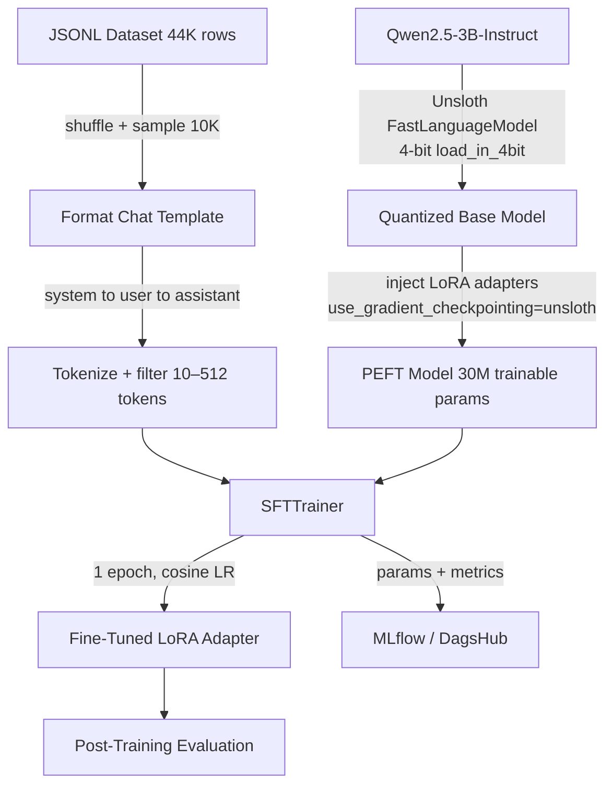
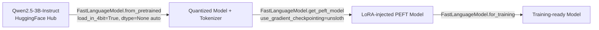
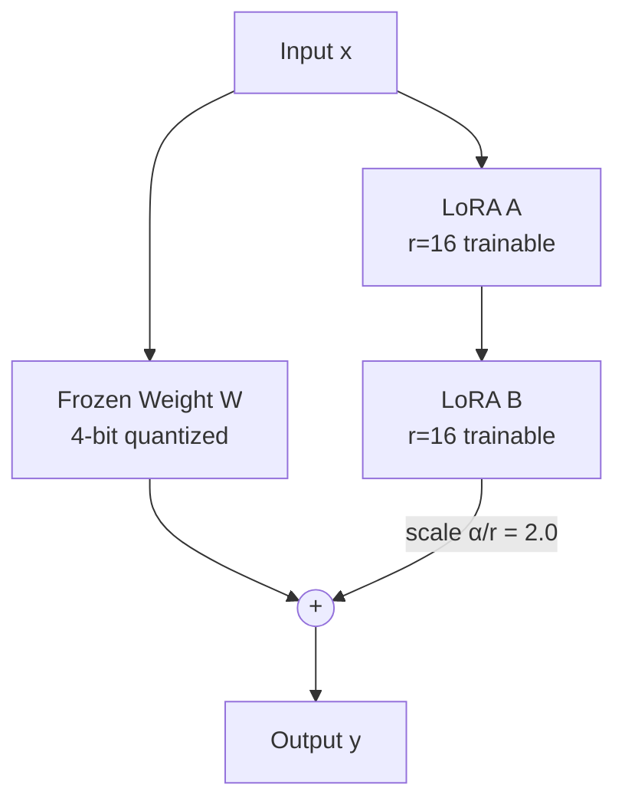
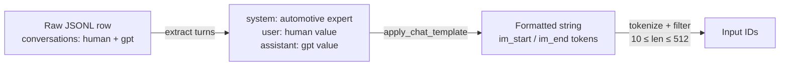

Fine-tunes `Qwen/Qwen2.5-3B-Instruct` on an automotive Q&A dataset using **QLoRA** — a memory-efficient technique that combines 4-bit quantization with low-rank adapter training (via PEFT/LoRA). The base model is loaded and optimized via **Unsloth** (`FastLanguageModel`), which handles quantization, LoRA injection, and gradient checkpointing in a single unified interface. All hyperparameters are config-driven via YAML files under `configs/`. Training is tracked end-to-end with **MLflow** (via DagsHub), and a post-training evaluation suite runs automatically after each training run.

---

**Training Pipeline**



---

**Model — Qwen2.5-3B-Instruct**

`Qwen2.5-3B-Instruct` is a 3-billion parameter instruction-tuned model from Alibaba's Qwen2.5 family. It uses a transformer decoder architecture with grouped-query attention (GQA), RoPE positional embeddings, and SwiGLU activations. The instruct variant is pre-aligned for chat-style interactions via supervised fine-tuning and RLHF, making it immediately compatible with a system prompt without additional alignment work.

| Property | Value |
|---|---|
| Parameters | 3.09B total |
| Architecture | Transformer decoder (GQA) |
| Context window | 32,768 tokens |
| Attention heads | 16 (query) / 8 (KV) |
| Hidden size | 2,048 |
| Intermediate size | 11,008 |
| Layers | 36 |
| Vocab size | 151,936 |
| Positional encoding | RoPE |
| Activation | SwiGLU |

---

**Model Loading — Unsloth**

The model and tokenizer are loaded via `FastLanguageModel.from_pretrained`, which internally handles 4-bit quantization, kernel fusion, and dtype selection. Unsloth's optimized kernels replace standard attention and FFN implementations, reducing memory overhead and improving throughput compared to a vanilla BitsAndBytes + PEFT setup.



| Setting | Value |
|---|---|
| `load_in_4bit` | `true` |
| `dtype` | `None` (auto-detected) |
| `use_gradient_checkpointing` | `"unsloth"` |
| `random_state` | `3407` |
| `use_rslora` | `false` |
| `loftq_config` | `None` |
| Model cache | `./models/hf_cache` |

---

**Fine-Tuning Technique — LoRA**

LoRA (Low-Rank Adaptation) avoids updating the full weight matrices by decomposing the weight update ΔW into two small matrices: ΔW = A × B, where A ∈ ℝ^(d×r) and B ∈ ℝ^(r×k) with rank r ≪ d. Only A and B are trained; the original frozen weights are never modified.

With r=16 and lora_alpha=32 (scaling factor α/r = 2.0), the adapter output is scaled to prevent the low-rank updates from being too small relative to the frozen weights. Dropout is disabled (0) since Unsloth's gradient checkpointing provides sufficient regularization.



LoRA is injected into all seven projection layers across every transformer block:

| Module | Role |
|---|---|
| `q_proj` | Query projection in self-attention |
| `k_proj` | Key projection in self-attention |
| `v_proj` | Value projection in self-attention |
| `o_proj` | Output projection after attention |
| `gate_proj` | Gate branch of SwiGLU FFN |
| `up_proj` | Up-projection branch of SwiGLU FFN |
| `down_proj` | Down-projection of FFN output |

| LoRA Parameter | Value | Notes |
|---|---|---|
| Rank `r` | 16 | Dimensionality of the low-rank update |
| `lora_alpha` | 32 | Scaling: effective scale = α/r = 2.0 |
| `lora_dropout` | 0 | Disabled |
| `bias` | `none` | No bias terms trained |
| Trainable params | ~29.9M | 0.96% of total 3.09B |
| Frozen params | ~3.08B | Base model, never updated |

---

**Dataset**

10,000 samples are drawn from a 44,773-row automotive Q&A JSONL file. Each row contains a `conversations` field with two turns (human → assistant). These are wrapped into a three-turn chat template (system → user → assistant) using the model's native `apply_chat_template`, which produces the exact token format the model was instruction-tuned on. After tokenization, sequences outside the range of 10–512 tokens are filtered out.



| Data Property | Value |
|---|---|
| Source file | `automotive_en_dataset.jsonl` |
| Total rows | 44,773 |
| Training sample size | 10,000 |
| Shuffle seed | 42 |
| System prompt | `You are an automotive expert assistant.` |
| Max sequence length | 512 tokens |
| Min sequence length | 10 tokens |
| Chat format | ChatML (`im_start` / `im_end`) |

---

**Training Configuration**

The optimizer is `adamw_8bit`, which stores optimizer states in 8-bit — critical for fitting training into limited VRAM alongside the quantized model. A cosine learning rate schedule decays the LR smoothly from `5e-5` to near zero, with 5 linear warmup steps to avoid instability at the start of training. Weight decay of 0.01 is applied for regularization.

Gradient accumulation over 2 steps gives an effective batch size of 8 without requiring more GPU memory. Unsloth's gradient checkpointing (`"unsloth"`) is used instead of standard checkpointing, reducing activation memory further.

| Parameter | Value | Notes |
|---|---|---|
| Epochs | 1 | Single pass over training samples |
| Batch size | 4 | Per device |
| Gradient accumulation | 2 | Effective batch = 8 |
| Learning rate | 5e-5 | Peak LR |
| LR schedule | cosine | Smooth decay to ~0 |
| Warmup steps | 5 | Linear warmup |
| Weight decay | 0.01 | L2 regularization |
| Optimizer | `adamw_8bit` | 8-bit optimizer states |
| Precision | bfloat16 | When supported, else fp16 |
| Max sequence length | 512 | Truncates longer examples |
| Packing | false | No sequence packing |
| Save strategy | epoch | Saves adapter after each epoch |
| Seed | 3407 | Training reproducibility |
| Output dir | `./output/qwen3b-automotive` | Adapter save location |

---

**Post-Training Evaluation**

After training completes, `src/evaluation.py` automatically runs a suite of metrics against held-out samples from the same dataset. Results are logged to MLflow and saved to `output/eval_results_<timestamp>.txt`. GPU metrics (VRAM peak, utilization, tokens/sec) are also written to the results file if the `GPUProfiler` is active.

| Metric | Description |
|---|---|
| Perplexity | Cross-entropy loss exponentiated over test samples |
| BLEU (approx) | Word-overlap precision between generated and reference answers |
| Similarity | String similarity ratio via `SequenceMatcher` |
| Avg latency (ms) | Mean generation time per prompt |
| Token throughput | Generated tokens per second |

Evaluation sample sizes and generation parameters are controlled via `configs/eval.yaml`.

| Eval Parameter | Value |
|---|---|
| `perplexity_samples` | 10 |
| `generation_samples` | 5 |
| `performance_samples` | 3 |
| `max_new_tokens_quality` | 100 |
| `max_new_tokens_performance` | 50 |
| `do_sample` | false |
| `temperature` | 0.1 |
| `test_seed` | 123 |

---

**Inference**

`src/inference.py` exposes a `run_inference` function that wraps the fine-tuned model in a `text-generation` pipeline. Generation parameters are loaded from `configs/inference.yaml`. `test.py` provides an interactive streaming interface using `TextStreamer` for manual testing of the trained adapter.

| Parameter | Default | Notes |
|---|---|---|
| `max_new_tokens` | 120 | Maximum tokens to generate |
| `temperature` | 0.7 | Sampling temperature |
| `top_p` | 0.9 | Nucleus sampling threshold |
| `repetition_penalty` | 1.1 | Penalizes repeated tokens |
| `do_sample` | true | Enables stochastic sampling |
| `eos_token` | `<\|im_end\|>` | Stop token for ChatML format |

---

**Experiment Tracking — MLflow**

All training runs are tracked via MLflow, backed by a DagsHub remote. The experiment is named `QwenDrive-QLoRA` and runs are tagged `qwen-drive-lora-training`. The following are logged automatically:

- Model, quantization, LoRA, training, and dataset parameters
- GPU memory usage (allocated and reserved) at start and end of training
- Final training metrics (loss, runtime, samples/sec)
- Post-training evaluation metrics (perplexity, BLEU, similarity, latency, throughput)
- GPU profiler metrics (VRAM peak, utilization avg/max, tokens/sec avg/max)
- `adapter_config.json` and `model_summary.json` as artifacts
- `output/eval_results_<timestamp>.txt` as artifact

Configure the tracking URI and credentials via `.env`:

```
MLFLOW_TRACKING_URI=<dagshub_mlflow_uri>
DAGSHUB_USERNAME=<username>
DAGSHUB_TOKEN=<token>
DAGSHUB_REPO_NAME=<repo_name>
```

---

**Project Structure**

```
├── configs/
│   ├── model.yaml        # Model name, quantization settings
│   ├── lora.yaml         # LoRA rank, alpha, dropout, target modules
│   ├── training.yaml     # SFTTrainer args, dataset sampling
│   ├── eval.yaml         # Evaluation sample sizes and generation params
│   └── inference.yaml    # Inference generation parameters
├── data/
│   └── automotive_en_dataset.jsonl
├── notebook/
│   └── training-notebook.ipynb
├── src/
│   ├── data.py           # Dataset loading, chat template formatting, length filtering
│   ├── model.py          # Unsloth model + tokenizer loading, LoRA injection
│   ├── trainer.py        # SFTTrainer construction and training loop
│   ├── evaluation.py     # Post-training evaluation suite (ModelEvaluator)
│   ├── inference.py      # Inference pipeline wrapper
│   ├── pipeline.py       # End-to-end orchestration
│   ├── metrics/
│   │   ├── metrics.py        # MLflow parameter/artifact logging helpers
│   │   ├── eval_metrics.py   # Perplexity, BLEU, similarity implementations
│   │   ├── eval_data.py      # Test data loader
│   │   └── gpu_profiler.py   # Background GPU monitoring (pynvml / nvidia-smi)
│   └── utils/
│       ├── logger.py         # Structured logger setup
│       └── mlflow.py         # DagsHub + MLflow init
├── scripts/
│   ├── check_gpu.sh          # GPU memory and temperature status
│   ├── check_sizes.sh        # Disk usage of model artifacts
│   ├── check_system_specs.sh # System hardware info
│   ├── clean_models.sh       # Remove cached model files
│   ├── clean_output.sh       # Remove output artifacts
│   ├── cleanup_all.sh        # Full cleanup
│   ├── hf_modelpush.sh       # Push adapter or merged model to HuggingFace Hub
│   └── status.sh             # Full project status summary
├── output/                   # Saved adapter weights and eval results
├── test.py                   # Interactive streaming inference tester
└── train.py                  # Entry point
```

---

**GPU Profiler**

`src/metrics/gpu_profiler.py` runs a background monitoring thread during training and evaluation. It samples VRAM usage and GPU utilization every second via `pynvml`, falling back to `nvidia-smi` subprocess calls if pynvml is unavailable, and further falling back to `torch.cuda` for VRAM-only tracking. Aggregated metrics (peak VRAM, avg/max utilization, avg/max tokens/sec) are logged to MLflow at the end of the run.

---

**HuggingFace Hub Push**

`scripts/hf_modelpush.sh` supports two upload modes, selected interactively at runtime:

| Mode | What's uploaded |
|---|---|
| Adapter only | `adapter_config.json` + `adapter_model.safetensors` + tokenizer |
| Full merged model | Base model merged with LoRA weights via `merge_and_unload()`, pushed as a standalone model |

Requires `HF_TOKEN` and `HF_USERNAME` in `.env`.

---

**Memory Footprint**

| Component | Approximate VRAM |
|---|---|
| Quantized base model (4-bit, Unsloth) | ~1.4 GB |
| LoRA adapter weights (bfloat16) | ~0.06 GB |
| Activations + gradients (Unsloth checkpointing) | ~6–8 GB |
| Optimizer states (8-bit) | ~0.5 GB on GPU |
| **Total** | **~10–12 GB** |

---

**Training Hardware**

| Component | Specification |
|---|---|
| GPU | 1× NVIDIA A10G Tensor Core GPU |
| GPU VRAM | 24 GB GDDR6 |
| vCPUs | 4 |
| RAM | 16 GiB |
| CPU | AMD EPYC 7R32 |
| Storage | NVMe SSD attached |
| Network | 1 Gbps |
| Architecture | x86_64 |
