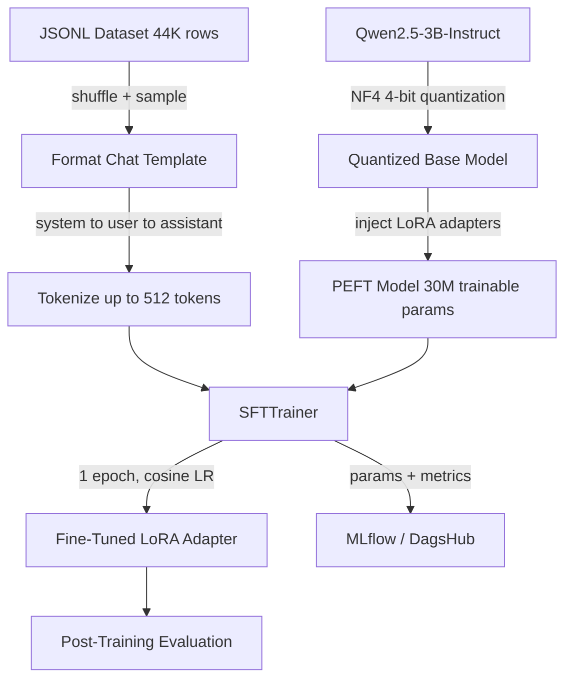
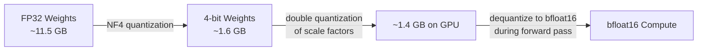
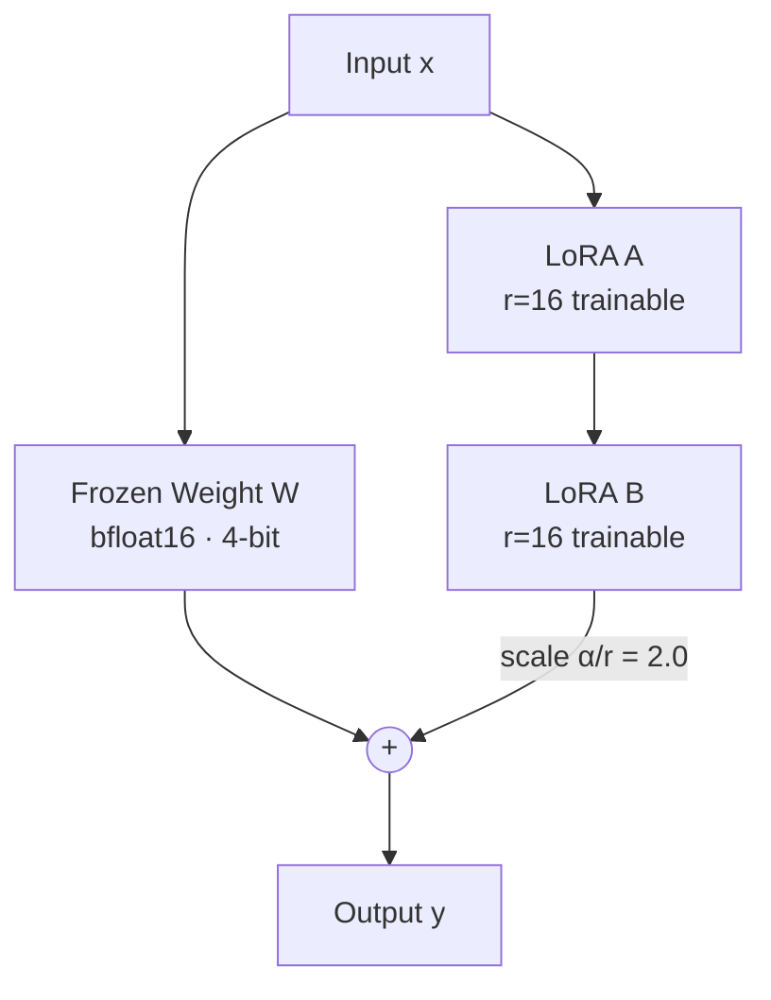
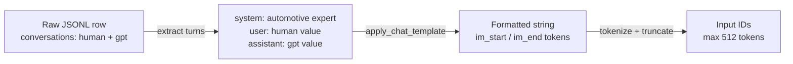

Fine-tunes `Qwen/Qwen2.5-3B-Instruct` on an automotive Q&A dataset using **QLoRA** — a memory-efficient technique that combines 4-bit quantization (via BitsAndBytes) with low-rank adapter training (via PEFT/LoRA). The base model weights are frozen and quantized to NF4 format with bfloat16 compute dtype and double quantization enabled, drastically reducing VRAM usage while preserving training quality. All hyperparameters are config-driven via YAML files under `configs/`. Training is tracked end-to-end with **MLflow** (via DagsHub), and a post-training evaluation suite runs automatically after each training run.

---

**Training Pipeline**



---

**Model — Qwen2.5-3B-Instruct**

`Qwen2.5-3B-Instruct` is a 3-billion parameter instruction-tuned model from Alibaba's Qwen2.5 family. It uses a transformer decoder architecture with grouped-query attention (GQA), RoPE positional embeddings, and SwiGLU activations. The instruct variant is pre-aligned for chat-style interactions via supervised fine-tuning and RLHF, making it immediately compatible with a system prompt without additional alignment work.

| Property | Value |
|---|---|
| Parameters | 3.09B total |
| Architecture | Transformer decoder (GQA) |
| Context window | 32,768 tokens |
| Attention heads | 16 (query) / 8 (KV) |
| Hidden size | 2,048 |
| Intermediate size | 11,008 |
| Layers | 36 |
| Vocab size | 151,936 |
| Positional encoding | RoPE |
| Activation | SwiGLU |

---

**Quantization — BitsAndBytes NF4**

The base model is loaded in 4-bit using NF4 (Normal Float 4) quantization. NF4 is an information-theoretically optimal data type for normally distributed weights — it places quantization bins at positions that minimize expected quantization error for Gaussian-distributed values, which neural network weights closely follow.

Double quantization is enabled, which quantizes the quantization constants themselves (from 32-bit to 8-bit), saving an additional ~0.4 bits per parameter. Forward pass compute is done in bfloat16 to maintain numerical stability during training.



| Setting | Value | Effect |
|---|---|---|
| `load_in_4bit` | `true` | Loads weights as 4-bit integers |
| `bnb_4bit_quant_type` | `nf4` | Optimal binning for normal distributions |
| `bnb_4bit_compute_dtype` | `bfloat16` | Stable compute with wide dynamic range |
| `bnb_4bit_use_double_quant` | `true` | Quantizes scale constants, saves ~0.4 bits/param |

---

**Fine-Tuning Technique — LoRA**

LoRA (Low-Rank Adaptation) avoids updating the full weight matrices by decomposing the weight update `ΔW` into two small matrices: `ΔW = A × B`, where `A ∈ R^(d×r)` and `B ∈ R^(r×k)` with rank `r << d`. Only `A` and `B` are trained; the original frozen weights are never modified.

With `r=16` and `lora_alpha=32` (scaling factor `α/r = 2.0`), the adapter output is scaled to prevent the low-rank updates from being too small relative to the frozen weights. Dropout of 0.05 is applied to the adapter inputs for regularization.



LoRA is injected into all seven projection layers across every transformer block:

| Module | Role |
|---|---|
| `q_proj` | Query projection in self-attention |
| `k_proj` | Key projection in self-attention |
| `v_proj` | Value projection in self-attention |
| `o_proj` | Output projection after attention |
| `gate_proj` | Gate branch of SwiGLU FFN |
| `up_proj` | Up-projection branch of SwiGLU FFN |
| `down_proj` | Down-projection of FFN output |

| LoRA Parameter | Value | Notes |
|---|---|---|
| Rank `r` | 16 | Dimensionality of the low-rank update |
| `lora_alpha` | 32 | Scaling: effective scale = α/r = 2.0 |
| `lora_dropout` | 0.05 | Applied to adapter inputs |
| Trainable params | ~29.9M | 0.96% of total 3.09B |
| Frozen params | ~3.08B | Base model, never updated |

---

**Dataset**

Samples are drawn from a 44,773-row automotive Q&A JSONL file. Each row contains a `conversations` field with two turns (human → assistant). These are wrapped into a three-turn chat template (system → user → assistant) using the model's native `apply_chat_template`, which produces the exact token format the model was instruction-tuned on. The sample size is controlled via `configs/training.yaml`.



| Data Property | Value |
|---|---|
| Source file | `automotive_en_dataset.jsonl` |
| Total rows | 44,773 |
| Shuffle seed | 42 |
| System prompt | `You are an automotive expert assistant.` |
| Max sequence length | 512 tokens |
| Chat format | ChatML (`im_start` / `im_end`) |

---

**Training Configuration**

The optimizer is `paged_adamw_8bit`, which stores optimizer states in 8-bit and pages them to CPU RAM when GPU memory is under pressure — critical for fitting training into 16GB VRAM alongside the quantized model. A cosine learning rate schedule decays the LR smoothly from `5e-5` to near zero, with a 3% linear warmup to avoid instability at the start of training.

Gradient accumulation over 2 steps gives an effective batch size of 8 without requiring more GPU memory.

| Parameter | Value | Notes |
|---|---|---|
| Epochs | 1 | Single pass over training samples |
| Batch size | 4 | Per device |
| Gradient accumulation | 2 | Effective batch = 8 |
| Learning rate | 5e-5 | Peak LR |
| LR schedule | cosine | Smooth decay to ~0 |
| Warmup ratio | 0.03 | ~15 warmup steps |
| Optimizer | `paged_adamw_8bit` | CPU-paged optimizer states |
| Precision | bfloat16 | Mixed precision training |
| Max sequence length | 512 | Truncates longer examples |
| Packing | false | No sequence packing |

---

**Post-Training Evaluation**

After training completes, `src/evaluation.py` automatically runs a suite of metrics against held-out samples from the same dataset. Results are logged to MLflow and saved to `output/eval_results_<timestamp>.txt`.

| Metric | Description |
|---|---|
| Perplexity | Cross-entropy loss exponentiated over test samples |
| BLEU (approx) | Word-overlap precision between generated and reference answers |
| Exact match | Fraction of generated answers that exactly match the reference |
| Avg latency (ms) | Mean generation time per prompt |
| Token throughput | Generated tokens per second |

Evaluation sample sizes and generation parameters are controlled via `configs/eval.yaml`.

---

**Inference**

`src/inference.py` exposes a `run_inference` function that wraps the fine-tuned model in a `text-generation` pipeline. Generation parameters are loaded from `configs/inference.yaml`.

| Parameter | Default | Notes |
|---|---|---|
| `max_new_tokens` | 120 | Maximum tokens to generate |
| `temperature` | 0.7 | Sampling temperature |
| `top_p` | 0.9 | Nucleus sampling threshold |
| `repetition_penalty` | 1.1 | Penalizes repeated tokens |
| `do_sample` | true | Enables stochastic sampling |
| `eos_token` | `<\|im_end\|>` | Stop token for ChatML format |

---

**Experiment Tracking — MLflow**

All training runs are tracked via MLflow, backed by a DagsHub remote. The following are logged automatically:

- Model, quantization, LoRA, training, and dataset parameters
- GPU memory usage (allocated and reserved) at start and end of training
- Final training metrics (loss, runtime, samples/sec)
- Post-training evaluation metrics (perplexity, BLEU, exact match, latency, throughput)
- `adapter_config.json` and `model_summary.json` as artifacts

Configure the tracking URI and credentials via `.env`:

```
MLFLOW_TRACKING_URI=<dagshub_mlflow_uri>
DAGSHUB_USERNAME=<username>
DAGSHUB_TOKEN=<token>
```

---

**Project Structure**

```
├── configs/
│   ├── model.yaml        # Model name, quantization settings
│   ├── lora.yaml         # LoRA rank, alpha, dropout, target modules
│   ├── training.yaml     # SFTTrainer args, dataset sampling
│   ├── eval.yaml         # Evaluation sample sizes and generation params
│   └── inference.yaml    # Inference generation parameters
├── data/
│   └── automotive_en_dataset.jsonl
├── src/
│   ├── data.py           # Dataset loading and chat template formatting
│   ├── model.py          # Tokenizer, quantized model, LoRA injection
│   ├── trainer.py        # SFTTrainer construction and training loop
│   ├── evaluation.py     # Post-training evaluation suite
│   ├── inference.py      # Inference pipeline wrapper
│   ├── pipeline.py       # End-to-end orchestration
│   ├── metrics/          # MLflow logging helpers and eval metric functions
│   └── utils/            # Logger and MLflow init utilities
├── scripts/              # Shell utilities (GPU check, cleanup, HF push)
├── output/               # Saved adapter weights and eval results
└── train.py              # Entry point
```

---

**Memory Footprint**

| Component | Approximate VRAM |
|---|---|
| Quantized base model (NF4) | ~1.4 GB |
| LoRA adapter weights (bfloat16) | ~0.06 GB |
| Activations + gradients | ~6–8 GB |
| Optimizer states (paged 8-bit) | ~0.5 GB on GPU |
| **Total** | **~10–12 GB** |

Requires a CUDA GPU with at least **16GB VRAM** (e.g. A10G, A100, RTX 3090/4090). Python 3.10+.
