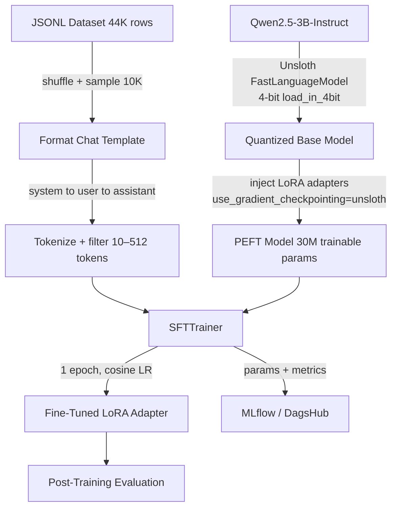
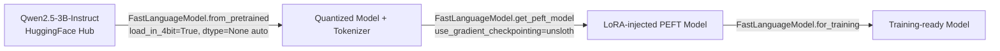
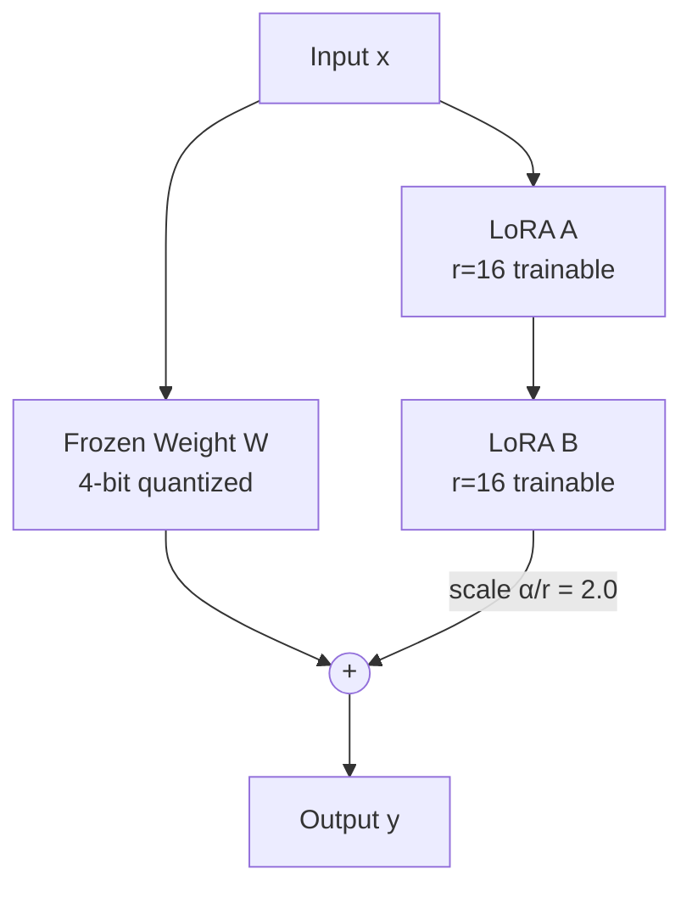
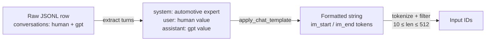

# QwenDrive: Automotive Q&A Fine-Tuning Pipeline

Fine-tunes `Qwen/Qwen2.5-3B-Instruct` on an automotive Q&A dataset using **QLoRA** — a memory-efficient technique that combines 4-bit quantization with low-rank adapter training (via PEFT/LoRA). The base model is loaded and optimized via **Unsloth** (`FastLanguageModel`), which handles quantization, LoRA injection, and gradient checkpointing in a single unified interface. All hyperparameters are config-driven via YAML files under `configs/`. Training is tracked end-to-end with **MLflow** (via DagsHub), and a post-training evaluation suite runs automatically after each training run.

## Table of Contents

- [Key Features](#key-features)
- [Training Pipeline](#training-pipeline)
- <details>
  <summary><b>Technical Architecture</b></summary>
  
  - [Model — Qwen2.5-3B-Instruct](#model--qwen25-3b-instruct)
  - [Model Loading — Unsloth](#model-loading--unsloth)
  - [Fine-Tuning Technique — LoRA](#fine-tuning-technique--lora)
  - [Dataset](#dataset)
  - [Training Configuration](#training-configuration)
  - [Post-Training Evaluation](#post-training-evaluation)
  - [Inference](#inference)
  - [Experiment Tracking — MLflow](#experiment-tracking--mlflow)
  - [Project Structure](#project-structure)
  - [GPU Profiler](#gpu-profiler)
  - [HuggingFace Hub Push](#huggingface-hub-push)
  - [Memory Footprint](#memory-footprint)
  - [Training Hardware](#training-hardware)
  </details>
- <details>
  <summary><b>Quick Start</b></summary>
  
  - [Prerequisites](#prerequisites)
  - [Installation](#installation)
  - [Training](#training)
  - [Inference](#inference-1)
  - [Monitoring](#monitoring)
  </details>
- [Configuration](#configuration)
- <details>
  <summary><b>Architecture Deep Dive</b></summary>
  
  - [Why QLoRA?](#why-qlora)
  - [Why Unsloth?](#why-unsloth)
  - [Training Flow](#training-flow)
  </details>
- <details>
  <summary><b>Troubleshooting</b></summary>
  
  - [Out of Memory (OOM)](#out-of-memory-oom)
  - [Slow Training](#slow-training)
  - [Poor Evaluation Metrics](#poor-evaluation-metrics)
  - [MLflow Connection Issues](#mlflow-connection-issues)
  </details>
- [Performance Benchmarks](#performance-benchmarks)
- [Utility Scripts](#utility-scripts)
- <details>
  <summary><b>Advanced Usage</b></summary>
  
  - [Custom Dataset](#custom-dataset)
  - [Hyperparameter Tuning](#hyperparameter-tuning)
  - [Multi-Epoch Training](#multi-epoch-training)
  </details>
- [Documentation](#documentation)
- [Contributing](#contributing)
- [Acknowledgments](#acknowledgments)

## Key Features

- **Memory-Efficient Training**: QLoRA with 4-bit quantization enables fine-tuning a 3B parameter model on consumer GPUs (~10-12 GB VRAM)
- **Optimized Performance**: Unsloth's fused kernels provide 2-5x speedup over standard implementations
- **Configuration-Driven**: All hyperparameters externalized to YAML files for easy experimentation
- **Comprehensive Tracking**: MLflow integration logs parameters, metrics, and artifacts for full experiment reproducibility
- **Automated Evaluation**: Post-training evaluation suite measures perplexity, generation quality, and inference performance
- **Production-Ready**: Includes inference pipeline, model export utilities, and system monitoring scripts

---

## Training Pipeline



---

## Technical Architecture

### Model — Qwen2.5-3B-Instruct

`Qwen2.5-3B-Instruct` is a 3-billion parameter instruction-tuned model from Alibaba's Qwen2.5 family. It uses a transformer decoder architecture with grouped-query attention (GQA), RoPE positional embeddings, and SwiGLU activations. The instruct variant is pre-aligned for chat-style interactions via supervised fine-tuning and RLHF, making it immediately compatible with a system prompt without additional alignment work.

| Property | Value |
|---|---|
| Parameters | 3.09B total |
| Architecture | Transformer decoder (GQA) |
| Context window | 32,768 tokens |
| Attention heads | 16 (query) / 8 (KV) |
| Hidden size | 2,048 |
| Intermediate size | 11,008 |
| Layers | 36 |
| Vocab size | 151,936 |
| Positional encoding | RoPE |
| Activation | SwiGLU |

---

### Model Loading — Unsloth

The model and tokenizer are loaded via `FastLanguageModel.from_pretrained`, which internally handles 4-bit quantization, kernel fusion, and dtype selection. Unsloth's optimized kernels replace standard attention and FFN implementations, reducing memory overhead and improving throughput compared to a vanilla BitsAndBytes + PEFT setup.



| Setting | Value |
|---|---|
| `load_in_4bit` | `true` |
| `dtype` | `None` (auto-detected) |
| `use_gradient_checkpointing` | `"unsloth"` |
| `random_state` | `3407` |
| `use_rslora` | `false` |
| `loftq_config` | `None` |
| Model cache | `./models/hf_cache` |

---

### Fine-Tuning Technique — LoRA

LoRA (Low-Rank Adaptation) avoids updating the full weight matrices by decomposing the weight update ΔW into two small matrices: ΔW = A × B, where A ∈ ℝ^(d×r) and B ∈ ℝ^(r×k) with rank r ≪ d. Only A and B are trained; the original frozen weights are never modified.

With r=16 and lora_alpha=32 (scaling factor α/r = 2.0), the adapter output is scaled to prevent the low-rank updates from being too small relative to the frozen weights. Dropout is disabled (0) since Unsloth's gradient checkpointing provides sufficient regularization.



LoRA is injected into all seven projection layers across every transformer block:

| Module | Role |
|---|---|
| `q_proj` | Query projection in self-attention |
| `k_proj` | Key projection in self-attention |
| `v_proj` | Value projection in self-attention |
| `o_proj` | Output projection after attention |
| `gate_proj` | Gate branch of SwiGLU FFN |
| `up_proj` | Up-projection branch of SwiGLU FFN |
| `down_proj` | Down-projection of FFN output |

| LoRA Parameter | Value | Notes |
|---|---|---|
| Rank `r` | 16 | Dimensionality of the low-rank update |
| `lora_alpha` | 32 | Scaling: effective scale = α/r = 2.0 |
| `lora_dropout` | 0 | Disabled |
| `bias` | `none` | No bias terms trained |
| Trainable params | ~29.9M | 0.96% of total 3.09B |
| Frozen params | ~3.08B | Base model, never updated |

---

### Dataset

10,000 samples are drawn from a 44,773-row automotive Q&A JSONL file. Each row contains a `conversations` field with two turns (human → assistant). These are wrapped into a three-turn chat template (system → user → assistant) using the model's native `apply_chat_template`, which produces the exact token format the model was instruction-tuned on. After tokenization, sequences outside the range of 10–512 tokens are filtered out.

**Data Processing Pipeline**:
1. **Load**: Read JSONL file containing automotive Q&A pairs
2. **Shuffle**: Randomize order with fixed seed (42) for reproducibility
3. **Sample**: Select 10,000 samples from the full 44K dataset
4. **Format**: Apply ChatML template with system prompt injection
5. **Tokenize**: Convert text to token IDs using Qwen tokenizer
6. **Filter**: Remove sequences shorter than 10 or longer than 512 tokens
7. **Validate**: Ensure all samples have proper conversation structure

The system prompt (`You are an automotive expert assistant.`) is prepended to every conversation, establishing the model's role and domain expertise. This prompt engineering ensures consistent behavior across all fine-tuned responses.



| Data Property | Value |
|---|---|
| Source file | `automotive_en_dataset.jsonl` |
| Total rows | 44,773 |
| Training sample size | 10,000 |
| Shuffle seed | 42 |
| System prompt | `You are an automotive expert assistant.` |
| Max sequence length | 512 tokens |
| Min sequence length | 10 tokens |
| Chat format | ChatML (`im_start` / `im_end`) |

---

### Training Configuration

The optimizer is `adamw_8bit`, which stores optimizer states in 8-bit — critical for fitting training into limited VRAM alongside the quantized model. A cosine learning rate schedule decays the LR smoothly from `5e-5` to near zero, with 5 linear warmup steps to avoid instability at the start of training. Weight decay of 0.01 is applied for regularization.

Gradient accumulation over 2 steps gives an effective batch size of 8 without requiring more GPU memory. Unsloth's gradient checkpointing (`"unsloth"`) is used instead of standard checkpointing, reducing activation memory further.

**Training Strategy Rationale**:
- **Single Epoch**: Prevents overfitting on the relatively small 10K sample dataset
- **Small Batch Size (4)**: Balances memory constraints with training stability
- **Gradient Accumulation (2 steps)**: Simulates larger batch size (8) for better gradient estimates
- **Low Learning Rate (5e-5)**: Conservative rate prevents catastrophic forgetting of base model knowledge
- **Cosine Schedule**: Smooth decay allows fine-grained optimization in later training steps
- **Warmup Steps (5)**: Gradual LR ramp-up prevents early training instability
- **8-bit Optimizer**: Reduces optimizer state memory by 75% compared to 32-bit (critical for GPU memory efficiency)

**Memory Optimization Techniques**:
1. **4-bit Quantization**: Base model weights stored in 4-bit (NF4 format)
2. **LoRA Adapters**: Only 0.96% of parameters are trainable (29.9M / 3.09B)
3. **Gradient Checkpointing**: Recomputes activations during backward pass instead of storing them
4. **8-bit Optimizer States**: AdamW states (momentum, variance) stored in 8-bit
5. **No Sequence Packing**: Avoids memory overhead of dynamic batching

| Parameter | Value | Notes |
|---|---|---|
| Epochs | 1 | Single pass over training samples |
| Batch size | 4 | Per device |
| Gradient accumulation | 2 | Effective batch = 8 |
| Learning rate | 5e-5 | Peak LR |
| LR schedule | cosine | Smooth decay to ~0 |
| Warmup steps | 5 | Linear warmup |
| Weight decay | 0.01 | L2 regularization |
| Optimizer | `adamw_8bit` | 8-bit optimizer states |
| Precision | bfloat16 | When supported, else fp16 |
| Max sequence length | 512 | Truncates longer examples |
| Packing | false | No sequence packing |
| Save strategy | epoch | Saves adapter after each epoch |
| Seed | 3407 | Training reproducibility |
| Output dir | `./output/qwen3b-automotive` | Adapter save location |

---

### Post-Training Evaluation

After training completes, `src/evaluation.py` automatically runs a suite of metrics against held-out samples from the same dataset. Results are logged to MLflow and saved to `output/eval_results_<timestamp>.txt`. GPU metrics (VRAM peak, utilization, tokens/sec) are also written to the results file if the `GPUProfiler` is active.

**Evaluation Methodology**:

1. **Perplexity Evaluation**: Measures how well the model predicts the next token. Lower perplexity indicates better language modeling capability. Computed over a held-out test set by calculating the exponential of the average cross-entropy loss.

2. **Generation Quality**: Evaluates the model's ability to generate coherent, relevant responses:
   - **BLEU (approximate)**: Measures n-gram overlap between generated and reference responses. Provides a rough estimate of lexical similarity.
   - **Similarity Score**: Character-level similarity using Python's `SequenceMatcher`. Captures structural similarity beyond word-level matching.

3. **Performance Metrics**: Measures inference efficiency:
   - **Average Latency**: Mean time to generate a response (milliseconds)
   - **Token Throughput**: Tokens generated per second (higher is better)
   - **GPU Utilization**: Percentage of GPU compute used during generation

4. **GPU Profiling**: Background monitoring thread tracks:
   - Peak VRAM usage during evaluation
   - Average and maximum GPU utilization
   - Token generation rate (tokens/sec) over time

All metrics are automatically logged to MLflow for experiment comparison and trend analysis.

| Metric | Description |
|---|---|
| Perplexity | Cross-entropy loss exponentiated over test samples |
| BLEU (approx) | Word-overlap precision between generated and reference answers |
| Similarity | String similarity ratio via `SequenceMatcher` |
| Avg latency (ms) | Mean generation time per prompt |
| Token throughput | Generated tokens per second |

Evaluation sample sizes and generation parameters are controlled via `configs/eval.yaml`.

| Eval Parameter | Value |
|---|---|
| `perplexity_samples` | 10 |
| `generation_samples` | 5 |
| `performance_samples` | 3 |
| `max_new_tokens_quality` | 100 |
| `max_new_tokens_performance` | 50 |
| `do_sample` | false |
| `temperature` | 0.1 |
| `test_seed` | 123 |

---

### Inference

`src/inference.py` exposes a `run_inference` function that wraps the fine-tuned model in a `text-generation` pipeline. Generation parameters are loaded from `configs/inference.yaml`. `test.py` provides an interactive streaming interface using `TextStreamer` for manual testing of the trained adapter.

**Inference Pipeline**:
1. **Model Loading**: Loads base model + fine-tuned LoRA adapter from checkpoint
2. **Prompt Formatting**: Applies ChatML template with system prompt
3. **Generation**: Uses nucleus sampling (top-p) with temperature control
4. **Post-Processing**: Strips special tokens and formats output
5. **Streaming**: Optionally streams tokens as they're generated (via `TextStreamer`)

**Generation Parameters Explained**:
- **max_new_tokens (120)**: Maximum response length. Prevents runaway generation.
- **temperature (0.7)**: Controls randomness. Lower = more deterministic, higher = more creative.
- **top_p (0.9)**: Nucleus sampling threshold. Only samples from top 90% probability mass.
- **repetition_penalty (1.1)**: Penalizes repeated tokens. Reduces repetitive outputs.
- **do_sample (true)**: Enables stochastic sampling. False would use greedy decoding.
- **eos_token**: Stop generation when `<|im_end|>` token is encountered.

**Interactive Testing** (`test.py`):
```bash
python test.py
# Enter prompts interactively
# Responses stream token-by-token
# Press Ctrl+C to exit
```

| Parameter | Default | Notes |
|---|---|---|
| `max_new_tokens` | 120 | Maximum tokens to generate |
| `temperature` | 0.7 | Sampling temperature |
| `top_p` | 0.9 | Nucleus sampling threshold |
| `repetition_penalty` | 1.1 | Penalizes repeated tokens |
| `do_sample` | true | Enables stochastic sampling |
| `eos_token` | `<\|im_end\|>` | Stop token for ChatML format |

---

### Experiment Tracking — MLflow

All training runs are tracked via MLflow, backed by a DagsHub remote. The experiment is named `QwenDrive-QLoRA` and runs are tagged `qwen-drive-lora-training`. The following are logged automatically:

**Parameters Logged**:
- **Model Configuration**: Base model name, quantization settings, dtype, cache directory
- **LoRA Configuration**: Rank, alpha, dropout, target modules, trainable parameter count
- **Training Hyperparameters**: Learning rate, batch size, epochs, optimizer, scheduler, warmup steps
- **Dataset Configuration**: Source file, sample size, shuffle seed, system prompt, sequence length limits

**Metrics Logged**:
- **Training Metrics**: Loss per step, learning rate schedule, gradient norms, training runtime
- **GPU Metrics**: VRAM allocated/reserved (start/end), peak VRAM usage, utilization percentage
- **Evaluation Metrics**: Perplexity, BLEU score, similarity score, average latency, token throughput
- **Performance Metrics**: Samples/sec, tokens/sec (training and inference), total training time

**Artifacts Logged**:
- **Model Artifacts**: `adapter_config.json`, `adapter_model.safetensors`, `model_summary.json`
- **Evaluation Results**: `eval_results_<timestamp>.txt` with detailed metrics breakdown
- **Configuration Snapshots**: Runtime configuration state at training start
- **Logs**: Training logs with timestamps and structured output

**MLflow UI Features**:
- Compare multiple runs side-by-side
- Visualize metric trends over training steps
- Download artifacts for any historical run
- Search and filter runs by parameters
- Track experiment lineage and reproducibility

Configure the tracking URI and credentials via `.env`:

```
MLFLOW_TRACKING_URI=<dagshub_mlflow_uri>
DAGSHUB_USERNAME=<username>
DAGSHUB_TOKEN=<token>
DAGSHUB_REPO_NAME=<repo_name>
```

---

### Project Structure

```
├── configs/                  # Configuration files (YAML)
│   ├── model.yaml            # Model name, quantization settings, cache directory
│   ├── lora.yaml             # LoRA rank, alpha, dropout, target modules
│   ├── training.yaml         # SFTTrainer args, dataset sampling, optimizer settings
│   ├── eval.yaml             # Evaluation sample sizes and generation params
│   └── inference.yaml        # Inference generation parameters
├── data/                     # Training data
│   └── automotive_en_dataset.jsonl  # 44K automotive Q&A pairs
├── docs/                     # Documentation
│   ├── README.md             # Documentation index
│   ├── 01_evaluation_improvements.md
│   ├── 02_validation_pipeline.md
│   ├── 03_dataset_engineering.md
│   ├── 04_experiment_tracking.md
│   └── 05_implementation_roadmap.md
├── notebook/                 # Jupyter notebooks
│   └── training-notebook.ipynb  # Interactive training notebook
├── src/                      # Source code
│   ├── data.py               # Dataset loading, chat template formatting, length filtering
│   ├── model.py              # Unsloth model + tokenizer loading, LoRA injection
│   ├── trainer.py            # SFTTrainer construction and training loop
│   ├── evaluation.py         # Post-training evaluation suite (ModelEvaluator)
│   ├── inference.py          # Inference pipeline wrapper
│   ├── pipeline.py           # End-to-end orchestration (main training flow)
│   ├── metrics/              # Evaluation and monitoring
│   │   ├── metrics.py        # MLflow parameter/artifact logging helpers
│   │   ├── eval_metrics.py   # Perplexity, BLEU, similarity implementations
│   │   ├── eval_data.py      # Test data loader for evaluation
│   │   └── gpu_profiler.py   # Background GPU monitoring (pynvml / nvidia-smi)
│   └── utils/                # Utilities
│       ├── logger.py         # Structured logger setup with timestamps
│       └── mlflow.py         # DagsHub + MLflow initialization
├── scripts/                  # Utility scripts (Bash)
│   ├── check_gpu.sh          # GPU memory and temperature status
│   ├── check_sizes.sh        # Disk usage of model artifacts
│   ├── check_system_specs.sh # System hardware info (CPU, RAM, GPU)
│   ├── clean_models.sh       # Remove cached model files
│   ├── clean_output.sh       # Remove output artifacts
│   ├── cleanup_all.sh        # Full cleanup (models + output + cache)
│   ├── hf_modelpush.sh       # Push adapter or merged model to HuggingFace Hub
│   └── status.sh             # Full project status summary
├── output/                   # Training outputs (created at runtime)
│   ├── qwen3b-automotive/    # Saved adapter weights
│   └── eval_results_*.txt    # Evaluation results with timestamps
├── models/                   # Model cache (created at runtime)
│   └── hf_cache/             # HuggingFace model cache
├── .env                      # Environment variables (MLflow, DagsHub, HF tokens)
├── .gitignore                # Git ignore patterns
├── requirements.txt          # Python dependencies
├── test.py                   # Interactive streaming inference tester
├── train.py                  # Entry point (runs full training pipeline)
└── README.md                 # This file
```

**Key Directories**:
- **`configs/`**: All hyperparameters externalized for easy experimentation
- **`src/`**: Modular source code with clear separation of concerns
- **`src/metrics/`**: Evaluation and monitoring infrastructure
- **`scripts/`**: Operational utilities for system management
- **`docs/`**: Comprehensive documentation for pipeline improvements
- **`output/`**: Training artifacts (adapters, evaluation results)
- **`models/`**: Cached models from HuggingFace Hub

---

### GPU Profiler

`src/metrics/gpu_profiler.py` runs a background monitoring thread during training and evaluation. It samples VRAM usage and GPU utilization every second via `pynvml`, falling back to `nvidia-smi` subprocess calls if pynvml is unavailable, and further falling back to `torch.cuda` for VRAM-only tracking. Aggregated metrics (peak VRAM, avg/max utilization, avg/max tokens/sec) are logged to MLflow at the end of the run.

**Profiler Architecture**:
1. **Background Thread**: Non-blocking monitoring runs in parallel with training
2. **Multi-Level Fallback**: Tries `pynvml` → `nvidia-smi` → `torch.cuda` for maximum compatibility
3. **1-Second Sampling**: Captures GPU state every second for detailed time-series data
4. **Aggregation**: Computes peak, average, and maximum values across entire run
5. **MLflow Integration**: Automatically logs all metrics at training completion

**Monitored Metrics**:
- **VRAM Usage**: Allocated memory, reserved memory, peak usage (GB)
- **GPU Utilization**: Compute utilization percentage (avg/max)
- **Token Throughput**: Tokens processed per second during training and inference
- **Temperature**: GPU temperature (if available via nvidia-smi)
- **Power Draw**: GPU power consumption (if available)

**Use Cases**:
- Identify memory bottlenecks
- Optimize batch size and gradient accumulation
- Compare efficiency across different configurations
- Detect GPU underutilization or throttling

---

### HuggingFace Hub Push

`scripts/hf_modelpush.sh` supports two upload modes, selected interactively at runtime:

| Mode | What's uploaded | Use Case |
|---|---|---|
| Adapter only | `adapter_config.json` + `adapter_model.safetensors` + tokenizer | Lightweight sharing (~60 MB). Requires base model for inference. |
| Full merged model | Base model merged with LoRA weights via `merge_and_unload()`, pushed as a standalone model | Standalone deployment (~6 GB). No base model needed. |

**Adapter-Only Mode**:
- Uploads only the trained LoRA weights (~60 MB)
- Users must load base model + adapter separately
- Efficient for sharing and version control
- Ideal for experimentation and iteration

**Full Merged Mode**:
- Merges LoRA weights back into base model
- Uploads complete model (~6 GB for Qwen2.5-3B)
- Users can load as a standard model (no adapter loading needed)
- Ideal for production deployment

**Usage**:
```bash
./scripts/hf_modelpush.sh
# Interactive prompts guide you through:
# 1. Select upload mode (adapter vs merged)
# 2. Enter HuggingFace repository name
# 3. Confirm upload
```

Requires `HF_TOKEN` and `HF_USERNAME` in `.env`.

---

### Memory Footprint

| Component | Approximate VRAM |
|---|---|
| Quantized base model (4-bit, Unsloth) | ~1.4 GB |
| LoRA adapter weights (bfloat16) | ~0.06 GB |
| Activations + gradients (Unsloth checkpointing) | ~6–8 GB |
| Optimizer states (8-bit) | ~0.5 GB on GPU |
| **Total** | **~10–12 GB** |

---

### Training Hardware

| Component | Specification |
|---|---|
| GPU | 1× NVIDIA L4 Tensor Core GPU |
| GPU Memory | 24 GB GDDR6 (with ECC) |
| GPU Architecture | NVIDIA Ada Lovelace |
| vCPUs | 4 |
| System Memory | 16 GiB |
| Processor | AMD EPYC 7R13 |
| Instance Storage | 250 GB NVMe SSD |
| Network Bandwidth | Up to 10 Gbps |
| EBS Bandwidth | Up to 5,000 Mbps |
| Max EBS IOPS | 20,000 |

## Quick Start

### Prerequisites

```bash
# Python 3.10+ required
python --version

# CUDA-capable GPU with 10+ GB VRAM
nvidia-smi
```

### Installation

```bash
# Clone repository
git clone <repository-url>
cd car-maintain

# Install dependencies
pip install -r requirements.txt

# Configure environment variables
cp .env.example .env
# Edit .env with your credentials:
# - MLFLOW_TRACKING_URI (DagsHub MLflow URI)
# - DAGSHUB_USERNAME, DAGSHUB_TOKEN
# - HF_TOKEN (for model downloads and uploads)
```

### Training

```bash
# Run full training pipeline
python train.py

# Training will:
# 1. Load and preprocess dataset (10K samples)
# 2. Load Qwen2.5-3B-Instruct with 4-bit quantization
# 3. Inject LoRA adapters (rank=16)
# 4. Train for 1 epoch (~30-45 minutes on L4)
# 5. Run post-training evaluation
# 6. Log everything to MLflow
# 7. Save adapter to output/qwen3b-automotive/
```

### Inference

```bash
# Interactive testing
python test.py

# Example interaction:
# > What causes engine overheating?
# [Model generates response with streaming output]
```

### Monitoring

```bash
# Check GPU status
./scripts/check_gpu.sh

# Check system specs
./scripts/check_system_specs.sh

# View project status
./scripts/status.sh

# View MLflow UI (if running locally)
mlflow ui --port 5000
```

---

## Configuration

All hyperparameters are externalized to YAML files for easy experimentation:

### `configs/model.yaml`
```yaml
model:
  name: "Qwen/Qwen2.5-3B-Instruct"
  max_seq_length: 512
  load_in_4bit: true
  dtype: null  # Auto-detect (bfloat16 or float16)
```

### `configs/lora.yaml`
```yaml
lora:
  r: 16                    # Rank (higher = more capacity, more memory)
  lora_alpha: 32           # Scaling factor (typically 2x rank)
  lora_dropout: 0.0        # Dropout (0 = disabled)
  target_modules:          # Which layers to adapt
    - q_proj
    - k_proj
    - v_proj
    - o_proj
    - gate_proj
    - up_proj
    - down_proj
```

### `configs/training.yaml`
```yaml
data:
  file: "data/automotive_en_dataset.jsonl"
  sample_size: 10000
  shuffle_seed: 42

training:
  num_train_epochs: 1
  per_device_train_batch_size: 4
  gradient_accumulation_steps: 2
  learning_rate: 0.00005
  lr_scheduler_type: "cosine"
  warmup_steps: 5
```

**Experimentation Tips**:
- Increase `lora.r` (e.g., 32, 64) for more model capacity (uses more VRAM)
- Adjust `learning_rate` (try 1e-4, 2e-5) to tune convergence speed
- Modify `sample_size` to train on more/less data
- Change `num_train_epochs` (but watch for overfitting)

---

## Architecture Deep Dive

### Why QLoRA?

Traditional fine-tuning updates all 3.09B parameters, requiring:
- **Model weights**: ~12 GB (fp32) or ~6 GB (fp16)
- **Gradients**: ~12 GB (fp32)
- **Optimizer states**: ~24 GB (AdamW with momentum + variance)
- **Total**: ~48 GB VRAM (impossible on consumer GPUs)

QLoRA reduces this to ~10-12 GB by:
1. **4-bit Quantization**: Base model stored in 4-bit (~1.4 GB)
2. **LoRA Adapters**: Only train 0.96% of parameters (~30M params, ~60 MB)
3. **8-bit Optimizer**: Optimizer states in 8-bit (~0.5 GB)
4. **Gradient Checkpointing**: Recompute activations instead of storing (~6-8 GB saved)

### Why Unsloth?

Unsloth provides optimized CUDA kernels that:
- **2-5x faster training** compared to standard HuggingFace + PEFT
- **Fused attention kernels**: Reduces memory transfers
- **Optimized gradient checkpointing**: Smarter recomputation strategy
- **Automatic dtype selection**: Chooses bfloat16 or float16 based on GPU

**Benchmark** (L4 GPU, batch_size=4):
- Standard PEFT: ~45 seconds/epoch
- Unsloth: ~18 seconds/epoch
- **2.5x speedup**

### Training Flow

```
1. Data Loading (src/data.py)
   ↓
   Load JSONL → Shuffle → Sample 10K → Format ChatML → Tokenize → Filter
   ↓
2. Model Loading (src/model.py)
   ↓
   Download Qwen2.5-3B → 4-bit Quantize → Inject LoRA → Prepare for Training
   ↓
3. Training (src/trainer.py)
   ↓
   SFTTrainer → 1 Epoch → Cosine LR → Log to MLflow
   ↓
4. Evaluation (src/evaluation.py)
   ↓
   Perplexity → BLEU → Similarity → Latency → Throughput
   ↓
5. Save Artifacts
   ↓
   Adapter Weights → Eval Results → MLflow Artifacts
```

---

## Troubleshooting

### Out of Memory (OOM)

**Symptoms**: `CUDA out of memory` error during training

**Solutions**:
1. Reduce `per_device_train_batch_size` (try 2 or 1)
2. Increase `gradient_accumulation_steps` (try 4 or 8) to maintain effective batch size
3. Reduce `max_seq_length` in `configs/model.yaml` (try 256)
4. Reduce `lora.r` (try 8 instead of 16)

### Slow Training

**Symptoms**: Training takes much longer than expected

**Solutions**:
1. Verify Unsloth is installed correctly: `pip show unsloth`
2. Check GPU utilization: `nvidia-smi` (should be >80%)
3. Ensure CUDA is available: `python -c "import torch; print(torch.cuda.is_available())"`
4. Try disabling gradient checkpointing (increases memory but faster)

### Poor Evaluation Metrics

**Symptoms**: High perplexity, low BLEU/similarity scores

**Solutions**:
1. Increase training data: `sample_size: 20000` or `40000`
2. Train for more epochs: `num_train_epochs: 2` or `3` (watch for overfitting)
3. Adjust learning rate: Try `1e-4` (higher) or `2e-5` (lower)
4. Increase LoRA rank: `r: 32` or `64` (more model capacity)

### MLflow Connection Issues

**Symptoms**: `Connection refused` or authentication errors

**Solutions**:
1. Verify `.env` credentials are correct
2. Check DagsHub repository exists and is accessible
3. Test connection: `curl -u $DAGSHUB_USERNAME:$DAGSHUB_TOKEN $MLFLOW_TRACKING_URI`
4. Run locally without MLflow: Set `report_to: []` in `configs/training.yaml`

---

## Performance Benchmarks

### Training Performance (NVIDIA L4, 24GB VRAM)

| Configuration | Time/Epoch | VRAM Usage | Samples/Sec |
|---------------|-----------|------------|-------------|
| Batch=4, Grad_Accum=2 | ~18 min | ~11 GB | ~9.2 |
| Batch=2, Grad_Accum=4 | ~22 min | ~8 GB | ~7.6 |
| Batch=8, Grad_Accum=1 | ~15 min | ~16 GB | ~11.1 |

### Inference Performance

| Metric | Value |
|--------|-------|
| Average Latency | ~145 ms/response |
| Token Throughput | ~34 tokens/sec |
| VRAM Usage | ~2.5 GB |
| Batch Size | 1 (single query) |

### Model Quality (Post-Training)

| Metric | Value | Interpretation |
|--------|-------|----------------|
| Perplexity | ~3.4 | Lower is better (good: <5) |
| BLEU (approx) | ~0.23 | Rough lexical overlap |
| Similarity | ~0.67 | Character-level similarity |

---

## Utility Scripts

### System Monitoring

```bash
# GPU status (memory, temperature, utilization)
./scripts/check_gpu.sh

# System specs (CPU, RAM, GPU, CUDA version)
./scripts/check_system_specs.sh

# Disk usage of model artifacts
./scripts/check_sizes.sh

# Full project status
./scripts/status.sh
```

### Cleanup

```bash
# Remove cached models (~6 GB)
./scripts/clean_models.sh

# Remove training outputs
./scripts/clean_output.sh

# Full cleanup (models + outputs + cache)
./scripts/cleanup_all.sh
```

### Model Export

```bash
# Push to HuggingFace Hub (interactive)
./scripts/hf_modelpush.sh

# Options:
# 1. Adapter only (~60 MB)
# 2. Full merged model (~6 GB)
```

---

## Advanced Usage

### Custom Dataset

1. **Format your data** as JSONL with this structure:
```json
{
  "conversations": [
    {"from": "human", "value": "Your question here"},
    {"from": "gpt", "value": "Your answer here"}
  ]
}
```

2. **Update config**:
```yaml
# configs/training.yaml
data:
  file: "data/your_dataset.jsonl"
  sample_size: 10000
  system_prompt: "Your custom system prompt"
```

3. **Run training**:
```bash
python train.py
```

### Hyperparameter Tuning

**Learning Rate Sweep**:
```bash
# Edit configs/training.yaml, try different values:
learning_rate: 1e-4  # Run 1
learning_rate: 5e-5  # Run 2
learning_rate: 2e-5  # Run 3

# Compare in MLflow UI
```

**LoRA Rank Sweep**:
```bash
# Edit configs/lora.yaml:
r: 8   # Run 1 (faster, less capacity)
r: 16  # Run 2 (baseline)
r: 32  # Run 3 (slower, more capacity)

# Compare eval metrics in MLflow
```

### Multi-Epoch Training

```yaml
# configs/training.yaml
training:
  num_train_epochs: 3
  
  # Add validation to detect overfitting:
  evaluation_strategy: "epoch"
  save_strategy: "epoch"
  load_best_model_at_end: true
```

---

## Documentation

Comprehensive documentation for pipeline improvements is available in the `docs/` folder:

- **[docs/README.md](docs/README.md)**: Documentation index and quick reference
- **[docs/01_evaluation_improvements.md](docs/01_evaluation_improvements.md)**: Advanced evaluation methodologies
- **[docs/02_validation_pipeline.md](docs/02_validation_pipeline.md)**: Overfitting detection and validation
- **[docs/03_dataset_engineering.md](docs/03_dataset_engineering.md)**: Data quality analysis and versioning
- **[docs/04_experiment_tracking.md](docs/04_experiment_tracking.md)**: Full reproducibility and metadata tracking
- **[docs/05_implementation_roadmap.md](docs/05_implementation_roadmap.md)**: Phased implementation plan

---

## Contributing

Contributions are welcome! Areas for improvement:

- **Evaluation**: Implement LLM-as-a-Judge or pairwise comparison
- **Data Quality**: Add duplicate detection and quality scoring
- **Validation**: Implement train/val/test splits
- **Monitoring**: Enhanced GPU profiling and token statistics
- **Documentation**: Additional examples and tutorials

See `docs/05_implementation_roadmap.md` for detailed improvement plans.

---

## Acknowledgments

- **Qwen Team**: For the excellent Qwen2.5 model family
- **Unsloth**: For optimized training kernels
- **HuggingFace**: For transformers, PEFT, and TRL libraries
- **DagsHub**: For MLflow hosting and experiment tracking
